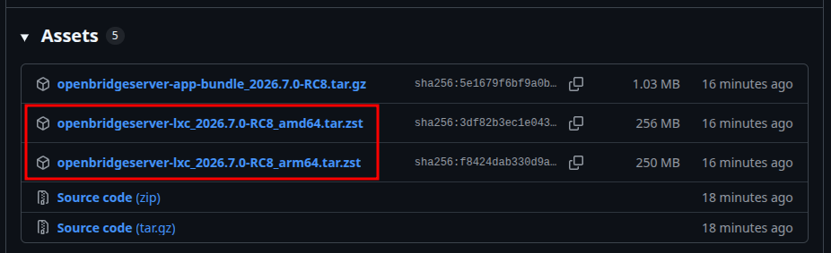
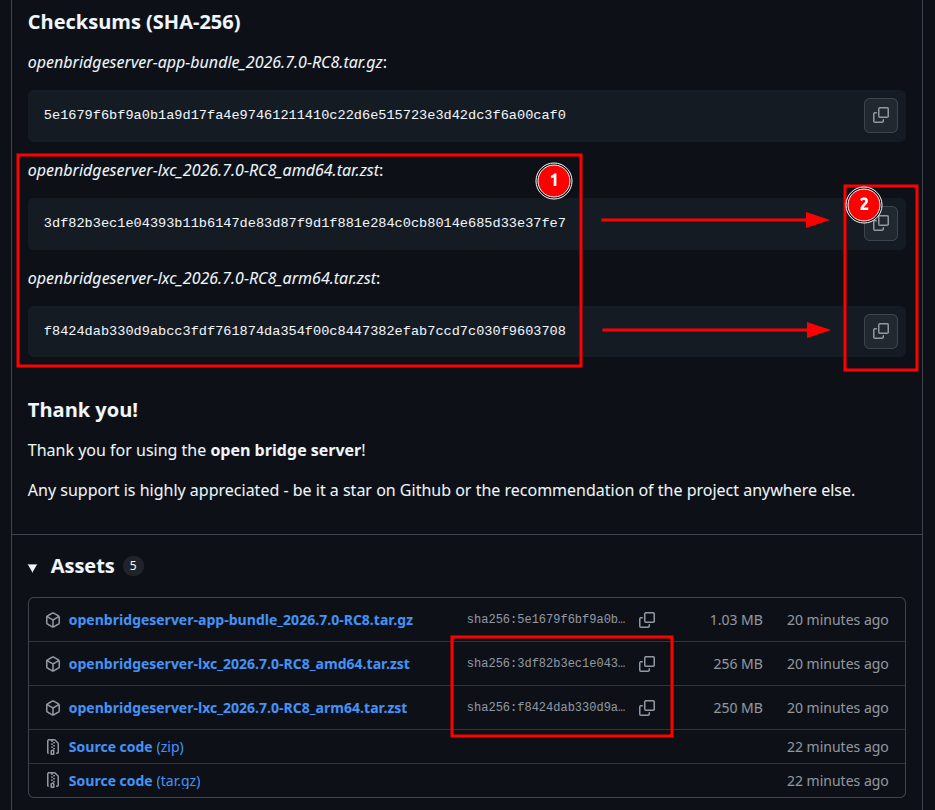
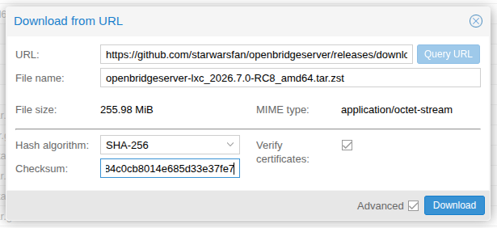

# open bridge multiprotocol ai server


[![Tests][tests-badge]][tests]
[![Coverage][coverage-badge]][coverage]

> 🇩🇪 [Deutsche Version](/README.de.md)

**Open building automation platform — connects KNX, Modbus, MQTT, Home Assistant, and more**

open bridge connects different building technology protocols into a unified system. All values can be monitored via a web interface, linked through logic, and forwarded via MQTT — without proprietary configuration files.

---

## What can open bridge do?

| Feature | Description |
|---|---|
| **Protocols** | KNX/IP (Tunneling + Routing + KNX IP Secure), Modbus TCP, Modbus RTU, 1-Wire, external MQTT, Home Assistant, ioBroker, SNMP, presence simulation, scheduler |
| **Multiple instances** | Any number of instances per protocol (e.g. 2× KNX, 3× Modbus TCP) |
| **Protocol bridge** | A KNX value is automatically written to a Modbus register — and vice versa |
| **Logic editor** | Visual automation logic without programming: 35+ block types, schedules, formulas, Python scripts, notifications, HTTP requests, sun position |
| **MQTT** | Stable UUID topic + readable alias topic; retain support |
| **Web interface** | Full operation via browser — no separate application required |
| **Database** | SQLite — no external database required |
| **History** | Value history with chart, time aggregation (hour / day / week …); configurable per data point |
| **Change log** | Last N value changes viewable (RingBuffer) — updates live |
| **Instant changes** | Changes take effect without restart |
| **Installation** | Docker Compose, directly as Python application, or as Proxmox LXC template |
| **License** | MIT (free and open source) |

---

## Table of Contents

1. [Quick start — Proxmox LXC](#quick-start--proxmox-lxc)
2. [Configuration](#configuration)
3. [How does open bridge work?](#how-does-open-bridge-work)
4. [Data points](#data-points)
5. [Bindings](#bindings)
6. [Search](#search)
7. [Adapters](#adapters)
8. [History](#history)
9. [Change log (RingBuffer)](#change-log-ringbuffer)
10. [Backup & Restore](#backup--restore)
11. [System status](#system-status)
12. [Log viewer](#log-viewer)
13. [Live connection (WebSocket)](#live-connection-websocket)
14. [Logic editor](#logic-editor)
15. [Adapter configuration](#adapter-configuration)
16. [MQTT topics](#mqtt-topics)
17. [Data types](#data-types)
18. [Settings](#settings)
19. [Helper scripts](#helper-scripts)
20. [Visualization (Visu)](#visualization-visu)
   - [Floor plan and system diagram widget](#floor-plan-and-system-diagram-widget)
21. [Development](#development)
   - [Local development with PyCharm](#local-development-with-pycharm)
   - [Local Git Hooks (Pre-Push Gate)](#local-git-hooks-pre-push-gate)

---

## Quick start — Proxmox LXC

The LXC template contains a complete Ubuntu 26.04 system with **open bridge server** and starts the service automatically when the container boots.

**Step 1 — Download the template**

1. On the [releases page](../../releases/latest), expand the assets and right-click to copy the URL of the `.tar.zst` file for your architecture:

   

2. In the Proxmox web interface, navigate to **Datacenter → Storage → local → CT Templates**.
3. Click **Download from URL**.
4. Paste the copied URL and click **Query URL**.
5. If not already enabled, activate **Advanced** in the bottom right of the popup.
6. Select **SHA256** as the hash algorithm.
7. On the [releases page](../../releases/latest), copy the checksum of the desired template from the **Checksums** section using the copy button:

   

   Note: If you copy the checksum directly from the column next to the asset, remove the `SHA256:` prefix, as Proxmox does not expect it!
8. Back in the Proxmox web interface, paste the copied hash into the **Checksum** field.
9. It should now look like this, for example:

   

10. Click **Download**.

**Step 2 — Create the container**

1. In the Proxmox menu, select **Create CT**.
2. Choose the just-downloaded `openbridgeserver-lxc_…` as the template.
3. Configure hostname, password, CPU, RAM, and network as needed — recommended: at least 512 MB RAM.
4. Start the container.

**Step 3 — Access**

| Service | Address |
|---|---|
| **open bridge server** web interface + API | `http://<container-ip>:8080` |

**Default credentials:** username `admin`, password `admin`
⚠️ Change the password immediately after first login (Settings → Password).

**Security configuration** (required):

```bash
# Set environment variables in /etc/obs.env, e.g.:
OBS_MQTT__HOST=192.168.1.10
# Set automatically in the LXC template on first boot (random, per container).
# Only set if you need a manual override:
OBS_SECURITY__JWT_SECRET=<at-least-32-random-characters>

# Restart the service
systemctl restart obs
```

---

## Configuration

Configuration is loaded in this order (higher = precedence):

1. Environment variables (`OBS_<SECTION>__<KEY>`)
2. `config.yaml` (path via `OBS_CONFIG`, default: `./config.yaml`)
3. Built-in defaults

```yaml
server:
  host: 0.0.0.0               # Network interface
  port: 8080                  # Web interface port
  log_level: INFO             # Log level: DEBUG|INFO|WARNING|ERROR

mqtt:
  host: localhost             # Internal Mosquitto broker
  port: 1883
  username: null              # Credentials for internal broker
  password: null

database:
  path: /data/obs.db      # Database file

ringbuffer:
  storage: file               # Change log: file-only
  max_entries: 10000          # Maximum number of entries
  max_file_size_bytes: null   # Optional: hard file size limit for the ring buffer
  max_age: null               # Optional: maximum entry age in seconds

security:
  jwt_secret: changeme        # Session key — must be changed!
  jwt_expire_minutes: 1440    # Session duration (default: 24 hours)
  # Optional override for the private/internal URL target allowlist.
  # Default: OBS_SECRET_FILE_DIR/url-target-allowlist.yaml when OBS_SECRET_FILE_DIR is set,
  # otherwise secrets/url-target-allowlist.yaml next to the configured database.
  # url_target_allowlist_path: /data/secrets/url-target-allowlist.yaml
```

> **Note:** The `mqtt` section refers to the **internal** Mosquitto broker. External MQTT brokers are set up as separate adapter instances (see [MQTT adapter](#mqtt-adapter-external-broker)).

### Offline administration with `obs-admin`

For support and failure scenarios, OBS ships an offline CLI that works directly on the SQLite configuration database and does not require the OBS HTTP server to be running.

In the LXC template, run the command inside the container:

```bash
obs-admin status
obs-admin db info
obs-admin adapters list
obs-admin adapters disable <instance-id-or-name>
obs-admin adapters enable <instance-id-or-name>
obs-admin bindings list --adapter <instance-id-or-name>
obs-admin bindings disable <binding-id>
obs-admin loglevel set DEBUG
obs-admin support-package create --output /tmp/obs-support.json
```

When upgrading an existing LXC container from a release that did not ship `obs-admin`, the first `obs-update` run may leave the command at `/opt/obs/obs-admin` without installing `/usr/local/bin/obs-admin`. In that case run `/opt/obs/obs-admin ...` directly or install the wrapper once with:

```bash
install -m 0755 /opt/obs/obs-admin /usr/local/bin/obs-admin
```

For Docker, run it on the host inside the OBS container, for example:

```bash
docker compose exec obs obs-admin status
docker compose exec obs obs-admin adapters disable <instance-id-or-name>
```

If the database is not at the normal configured path, pass it explicitly:

```bash
obs-admin --db /data/obs.db adapters list --json
obs-admin --db /data/obs.db db backup --output /var/backups/obs/
```

Write commands create a SQLite backup next to the database before changing data by default. The offline support package uses the same central sanitizing logic as the support API and redacts secrets, tokens, passwords, endpoints, and full filesystem paths.

### URL target allowlist for internal services

Backend fetches from logic API-client nodes, iCalendar nodes, Pushover `image_url` attachments, the camera proxy, and the weather API block private/local network targets by default. Admins can allow deliberate internal targets under **Settings → Security → URL Target Allowlist** or by editing the YAML file configured through `security.url_target_allowlist_path`.

By default, the YAML file is written to `OBS_SECRET_FILE_DIR/url-target-allowlist.yaml` when `OBS_SECRET_FILE_DIR` is set. Otherwise OBS writes it to `secrets/url-target-allowlist.yaml` next to the configured database file. For private targets, use an IP address or CIDR entry, for example `192.168.1.23/32` for a single LAN camera or `10.38.113.0/24` for an internal subnet.

If a hostname such as `internal.example` resolves to a private IP address, allowlist the resolved IP or CIDR. A hostname-only entry does not override private-IP blocking and does not bypass DNS validation.

---

## How does open bridge work?

```
┌──────────────────────────────────────────────────────────────┐
│                        open bridge server                    │
│                                                              │
│  ┌─────────────────────┐  value change  ┌─────────────────┐  │
│  │   Adapter instances │ ─────────────▶ │   Event bus     │  │
│  │                     │ ◀── write      │  (distributes   │  │
│  │  KNX, Modbus,       │                │  to all subs)   │  │
│  │  MQTT, 1-Wire …     │                └──┬──────┬───────┘  │
│  └─────────────────────┘                   │      │          │
│                                     ┌──────▼─┐ ┌──▼──────┐   │
│                                     │ Value  │ │ History │   │
│                                     │ store  │ │ RingBuf │   │
│                                     │        │ │ MQTT    │   │
│                                     └────────┘ │ WS      │   │
│                                                └─────────┘   │
│                                                              │
│  ┌───────────────────────────────────────────────────────┐   │
│  │                  Logic editor                         │   │
│  │  Value change → run graph → write DataPoint           │   │
│  └───────────────────────────────────────────────────────┘   │
│                                                              │
│  ┌───────────────────────────────────────────────────────┐   │
│  │                   REST API + WebSocket                │   │
│  └───────────────────────────────────────────────────────┘   │
└──────────────────────────────────────────────────────────────┘
```

**Core principles:**
- **Adapters** read values from the building (KNX telegram, Modbus register, MQTT message, …) and report them to the event bus.
- The **event bus** distributes every value simultaneously to: the value store (current state), history, change log, MQTT broker, WebSocket clients, and the logic editor.
- The **logic editor** reacts to value changes, executes automation logic, and writes results back to data points.
- **Protocol bridge:** When a value is received via one protocol, **open bridge server** automatically writes it to all other linked protocols — without additional configuration.

---

## Data points

A data point is the central object in **open bridge server**. Every physical or virtual value in the system — a temperature, a switch state, an energy meter — is a data point.

```
GET    /api/v1/datapoints?page=0&size=50       # List (paginated)
POST   /api/v1/datapoints                      # Create new
GET    /api/v1/datapoints/{id}                 # Load single (incl. current value)
PATCH  /api/v1/datapoints/{id}                 # Update
DELETE /api/v1/datapoints/{id}                 # Delete (also removes all bindings)
GET    /api/v1/datapoints/{id}/value           # Current value only
```

**Fields:**

| Field | Description |
|---|---|
| `name` | Human-readable name, e.g. "Living room temperature" |
| `data_type` | Data type: `BOOLEAN`, `INTEGER`, `FLOAT`, `STRING`, `DATE`, `TIME`, `DATETIME` |
| `unit` | Unit, e.g. `°C`, `%rH`, `kWh`, `lx`, `mm/h`, `nSv/h` |
| `tags` | Keywords for grouping and filtering |
| `persist_value` | Restore last value on restart (default: `true`) |
| `record_history` | Save value history to database (default: `true`). Set to `false` to exclude a data point from history. |
| `mqtt_topic` | Assigned automatically: `dp/{uuid}/value` |
| `mqtt_alias` | Readable alias topic, e.g. `alias/climate/living-room/value` |

```bash
# Create a temperature data point
curl -X POST http://localhost:8080/api/v1/datapoints \
  -H "Authorization: Bearer {token}" \
  -H "Content-Type: application/json" \
  -d '{
    "name": "Living room temperature",
    "data_type": "FLOAT",
    "unit": "°C",
    "tags": ["climate", "living-room"]
  }'
```

---

## Bindings

A binding connects a data point to an adapter instance and an address (e.g. KNX group address or Modbus register).

```
GET    /api/v1/datapoints/{id}/bindings
POST   /api/v1/datapoints/{id}/bindings
PATCH  /api/v1/datapoints/{id}/bindings/{binding_id}
DELETE /api/v1/datapoints/{id}/bindings/{binding_id}
```

**Directions:**

| Direction | Meaning |
|---|---|
| `SOURCE` | Read: adapter receives values and forwards them to **open bridge server** |
| `DEST` | Write: **open bridge server** sends values to the adapter |
| `BOTH` | Both simultaneously |

**Value transformation (`value_formula`):**

Optional: a formula applied to the value before it enters the system (SOURCE) or leaves it (DEST). The variable is always `x`.

```json
{ "value_formula": "x / 10" }
```

| Formula | Effect |
|---|---|
| `x * 3600` | Hours → seconds |
| `x / 10` | Fixed-point divide by 10 |
| `round(x, 2)` | Round to 2 decimal places |
| `max(0, min(100, x))` | Clamp to 0–100 |

Available functions: `abs`, `round`, `min`, `max`, and all `math.*` functions. Division by zero and invalid results are caught — the original value is preserved.

> **Note:** `round()` uses mathematical rounding (0.5 → round up), not the "banker's rounding" common in programming.

**Value mapping (`value_map`):**

Optional: a table that maps raw values to other values — useful for enumerations or status texts.

```json
{ "value_map": { "0": "Off", "1": "On", "2": "Standby" } }
```

The key is always a string (the raw value is converted internally). Matching first tries the exact key and then a case-insensitive key, so `OFF` matches a map entry like `"off"`. If no matching entry exists, the original value is passed through unchanged. `value_map` is applied after `value_formula`.

**Send filters** (DEST/BOTH only, checked in order):

| Filter | Description |
|---|---|
| `send_throttle_ms` | Minimum interval between two writes in milliseconds |
| `send_on_change` | Only send if the value has changed |
| `send_min_delta` | Only send if the deviation from the last value is at least this large (absolute) |
| `send_min_delta_pct` | Only send if the deviation is at least this large (percentage) |

**Example: KNX temperature → Modbus register**

```bash
# 1. Create data point
DP_ID=$(curl -s -X POST http://localhost:8080/api/v1/datapoints \
  -H "Authorization: Bearer {token}" \
  -H "Content-Type: application/json" \
  -d '{"name":"Living room temperature","data_type":"FLOAT","unit":"°C"}' \
  | jq -r .id)

# 2. KNX binding (read from GA 1/2/3)
curl -X POST http://localhost:8080/api/v1/datapoints/$DP_ID/bindings \
  -H "Authorization: Bearer {token}" \
  -H "Content-Type: application/json" \
  -d '{"adapter_instance_id": "KNX-UUID", "direction": "SOURCE",
       "config": {"group_address": "1/2/3", "dpt_id": "DPT9.001"}}'

# 3. Modbus binding (write to register 100)
curl -X POST http://localhost:8080/api/v1/datapoints/$DP_ID/bindings \
  -H "Authorization: Bearer {token}" \
  -H "Content-Type: application/json" \
  -d '{"adapter_instance_id": "MODBUS-UUID", "direction": "DEST",
       "config": {"unit_id": 1, "register_type": "holding", "address": 100, "data_format": "float32"}}'
```

---

## Search

Server-side search across all data points. Never returns the entire dataset.

```
GET /api/v1/search?q=&tag=&type=&adapter=&page=0&size=50
```

| Parameter | Description |
|---|---|
| `q` | Search in name |
| `tag` | Filter by tag |
| `type` | Filter by data type (e.g. `FLOAT`) |
| `adapter` | Filter by protocol (e.g. `KNX`) |

---

## Adapters

Each adapter type can run in multiple independent instances. All instances are managed via the web interface or the API.

**Adapter configuration is done entirely through the web interface** — all fields are dynamically rendered from the JSON schema of the respective adapter. Password fields appear masked. Changes take effect immediately without restart.

```
GET    /api/v1/adapters/instances              # All instances with status
POST   /api/v1/adapters/instances              # Create new instance
PATCH  /api/v1/adapters/instances/{id}         # Change configuration + reconnect
DELETE /api/v1/adapters/instances/{id}         # Stop + delete
POST   /api/v1/adapters/instances/{id}/restart # Reconnect
POST   /api/v1/adapters/instances/{id}/test    # Test connection

GET    /api/v1/adapters/{type}/schema          # JSON schema for instance configuration
GET    /api/v1/adapters/{type}/binding-schema  # JSON schema for binding configuration
```

### Authentication and access management

**open bridge server** supports two authentication methods:

| Method | Usage |
|---|---|
| Username + password → JWT token | Web interface, browser |
| API key (`X-API-Key: obs_…`) | Scripts, automations |

```
POST   /api/v1/auth/login                              # Login → receive token
POST   /api/v1/auth/refresh                            # Refresh token

GET    /api/v1/auth/users                              # All users (admin only)
POST   /api/v1/auth/users                              # Create user (admin only)
DELETE /api/v1/auth/users/{username}                   # Delete user (admin only)
POST   /api/v1/auth/me/change-password                 # Change own password

POST   /api/v1/auth/apikeys                            # Create API key
DELETE /api/v1/auth/apikeys/{id}                       # Revoke API key

POST   /api/v1/auth/users/{username}/mqtt-password     # Set up MQTT access
DELETE /api/v1/auth/users/{username}/mqtt-password     # Remove MQTT access
```

**MQTT access:** The internal Mosquitto broker is password-protected. Each user can receive a separate MQTT account (independent of the login password) to connect directly to the broker.

---

## History

Value history of a data point — raw or aggregated.

```
GET /api/v1/history/{id}?from=&to=&limit=
GET /api/v1/history/{id}/aggregate?fn=avg&interval=1h&from=&to=
```

**Aggregation functions:** `avg` (average), `min`, `max`, `last`

**Time intervals:** `1m`, `5m`, `15m`, `30m`, `1h`, `6h`, `12h`, `1d`

All timestamps follow the timezone configured in the settings.

**Control recording:** The `record_history` field on the data point controls whether values are written to the history. Data points with `record_history: false` are ignored by the history module. Management is done under Settings → History.

---

## Change log (RingBuffer)

The RingBuffer stores the last N value changes as a log. In the web interface, the list updates **immediately** (without reloading), since new entries are transmitted live via the WebSocket connection.

```
GET  /api/v1/ringbuffer?q=&adapter=&from=&limit=   # Query entries
POST /api/v1/ringbuffer/query                       # v2 query DSL (filter groups + pagination + sorting)
POST /api/v1/ringbuffer/export/csv                  # CSV export of complete filtered result set
GET  /api/v1/ringbuffer/stats                       # Entry count, capacity
POST /api/v1/ringbuffer/config                      # Change file-only + capacity
```

The `q` parameter searches both the name and the ID of the data point.

`POST /api/v1/ringbuffer/query` uses a filter DSL with clear semantics:
- `filters.adapters.any_of`: OR within the adapter list.
- `filters.values`: type-aware value filters (`eq/ne/gt/gte/lt/lte/between/contains/regex`) matching `data_type`.
- `filters.metadata`: filterable snapshot metadata from DataPoint/Binding context (`tags`, `adapter_types`, `group_addresses`, `topics`, `entity_ids`, `register_types`, `register_addresses`).
- Filter groups (`time`, `adapters`, `datapoints`, `values`, `metadata`, `q`) are combined with AND.
- Time filters support open boundaries (`from` without `to`, `to` without `from`) and the combination of absolute bounds (`from`/`to`) plus relative offsets (`from_relative_seconds`/`to_relative_seconds`).
- Pagination via `pagination.limit` + `pagination.offset`, sorting via `sort.field` (`id|ts`) and `sort.order` (`asc|desc`).
- The versioned metadata model is documented in `docs/ringbuffer-metadata-model-v1.md` (`metadata_version: 1`).

`POST /api/v1/ringbuffer/export/csv` uses the same request body as `/query`, but always exports the complete filtered result set (UI pagination is ignored).

CSV columns: `id`, `ts`, `datapoint_id`, `name`, `topic`, `old_value_json`, `new_value_json`, `source_adapter`, `quality`, `metadata_version`, `metadata_json`.

---

## Backup & Restore

Complete configuration backup and restore. Existing entries are updated, missing ones are created.

```
GET  /api/v1/config/export    # Download backup file (JSON)
POST /api/v1/config/import    # Restore backup file
```

The backup contains: all data points, bindings, adapter instances, and KNX group addresses.

**Import KNX project file:**

```
POST /api/v1/knxproj/import   # Upload .knxproj file (multipart/form-data)
GET  /api/v1/knxproj/ga       # Show imported group addresses
DELETE /api/v1/knxproj/ga     # Delete all imported addresses
```

After import, the group addresses appear as search suggestions in the binding form.

---

## System status

```
GET /api/v1/system/health      # Check reachability (no login required)
GET /api/v1/system/adapters    # Adapter status + binding count
GET /api/v1/system/datatypes   # All available data types
GET /api/v1/system/settings    # Read system settings (e.g. timezone)
PUT /api/v1/system/settings    # Update system settings

GET /api/v1/adapters/knx/dpts  # List all registered KNX DPT types
```

---

## Log viewer

The log viewer shows recent application log messages in real time. The admin GUI displays the last 500 entries and streams new entries live via WebSocket.

```
GET /api/v1/system/logs?limit=N   # Recent log entries (newest first, max 500)
GET /api/v1/system/log-level      # Read current log level (admin only)
PUT /api/v1/system/log-level      # Change log level at runtime (admin only)
```

Log entries have the following fields:

| Field | Description |
|---|---|
| `ts` | Timestamp (ISO 8601, UTC) |
| `level` | Log level: `DEBUG`, `INFO`, `WARNING`, `ERROR` |
| `logger` | Logger name (module path) |
| `message` | Log message |

The log level can be changed at runtime without a restart (admin only). The buffer holds the last 500 entries and is not persisted across restarts.

---

## Live connection (WebSocket)

Via the WebSocket connection, value changes and new RingBuffer entries are immediately transmitted to all connected browsers — no manual reload required.

```
WS /api/v1/ws?token={jwt}
```

**Subscribe to data point:**
```json
{"action": "subscribe", "datapoint_ids": ["uuid-1", "uuid-2"]}
```

**Incoming value change:**
```json
{
  "id": "550e8400-e29b-41d4-a716-446655440000",
  "v": 21.4,
  "u": "°C",
  "t": "2026-03-27T10:23:41.123Z",
  "q": "good"
}
```

**New RingBuffer entry** (to all connections, without subscription):
```json
{
  "action": "ringbuffer_entry",
  "entry": {
    "ts": "2026-03-27T10:23:41.123Z",
    "datapoint_id": "550e8400-...",
    "name": "Living room temperature",
    "new_value": 21.4,
    "old_value": 21.1,
    "quality": "good",
    "source_adapter": "KNX"
  }
}
```

**Data quality (`q`):**

| Value | Meaning |
|---|---|
| `good` | Value received successfully, connection active |
| `bad` | Adapter disconnected or read error |
| `uncertain` | Connection being restored or value possibly stale |

---

## Logic editor

### Overview

The logic editor enables visual creation of automation rules — without programming knowledge. Blocks are placed on a canvas by drag & drop and connected with lines.

**Flow:**
1. A **Read DP** block monitors a data point.
2. When the value changes, **open bridge server** executes the entire graph.
3. Blocks are evaluated in sequence.
4. A **Write DP** block writes the result back — this automatically triggers all adapters, MQTT, history, and the RingBuffer.
5. The **Trigger** block fires the graph on a schedule (e.g. daily at 07:00).

The graph can also be started manually via the **▶ Run** button.

**States** (hysteresis, statistics, operating hours, min/max tracker, consumption counter) are stored in the database and survive a restart.

---

### Block types

#### Constant

| Block | Outputs | Description |
|---|---|---|
| **Fixed value** | Value | Outputs a fixed value — number, on/off, or text. |

#### Logic

| Block | Inputs | Outputs | Description |
|---|---|---|---|
| **AND** | A, B | Out | True when **all** inputs are true. |
| **OR** | A, B | Out | True when **at least one** input is true. |
| **NOT** | In | Out | Inverts the input. |
| **XOR** | A, B | Out | True when **exactly one** input is true. |
| **Compare** | A, B | Result | Compares two values. Options: `>` `<` `=` `>=` `<=` `≠` |
| **Hysteresis** | Value | Out | Switches on when the value exceeds "threshold ON", and switches off only when it falls below "threshold OFF". Prevents rapid toggling. |

#### Data point

| Block | Inputs | Outputs | Description |
|---|---|---|---|
| **Read DP** | — | Value, Changed | Reads a data point. Automatically triggers the graph on value change. Optional filters (minimum interval, minimum change) and value transformation. |
| **Write DP** | Value, Trigger | — | Writes a value to a data point. Optional trigger input: only write when trigger is true. Optional filters and value transformation. |

#### Math

| Block | Inputs | Outputs | Description |
|---|---|---|---|
| **Formula** | a, b | Result | Calculates an expression from inputs `a` and `b`. Optional: a second formula to transform the result (variable `x`). |
| **Scale** | Value | Result | Converts a value from one range to another, e.g. 0–255 → 0–100%. |
| **Limiter** | Value | Result | Clamps the value to a range [Min, Max]. Values below or above are set to the limit. |
| **Statistics** | Value, Reset | Min, Max, Average, Count | Keeps running statistics over all received values. Reset clears everything. Results are saved and survive a restart. |
| **Min/Max tracker** | Value | Daily min, Daily max, Weekly min, Weekly max, Monthly min, Monthly max, Yearly min, Yearly max, Absolute min, Absolute max | Tracks minimum and maximum values over various time periods (daily, weekly, monthly, yearly, absolute). Resets automatically at period boundaries. |
| **Consumption counter** | Value (meter reading) | Daily, Weekly, Monthly, Yearly, Previous day, Previous week, Previous month, Previous year | Calculates consumption from a cumulative meter reading. Stores previous period values for comparison. |
| **Summer/Winter (DIN)** | Value (outdoor temperature) | Heating mode, Daily average, Monthly average | Controls heating switchover per DIN standard using three daily readings (T1 ≈ 07:00, T2 ≈ 14:00, T3 ≈ 22:00). Daily average = (T1 + T2 + 2×T3) / 4. |

#### Text

| Block | Inputs | Outputs | Description |
|---|---|---|---|
| **Concatenate** | 2–20 inputs (configurable) | Result | Joins multiple texts into one. Optional separator (e.g. `,` or ` `). |

#### Timer

| Block | Inputs | Outputs | Description |
|---|---|---|---|
| **Delay** | Trigger | Trigger | Delays a signal by N seconds. |
| **Pulse** | Trigger | Out | Outputs "True" for N seconds, then "False". |
| **Trigger** | — | Trigger | Fires the graph on a schedule (cron format). Configurable via templates, a visual editor (min/hour/day/month/weekday), or direct expression entry. |
| **Operating hours** | Active, Reset | Hours | Counts operating hours while "Active" is true. Saved counter survives restarts. |

#### Script

| Block | Inputs | Outputs | Description |
|---|---|---|---|
| **Python script** | a, b, c | Result | Executes Python code. Input values are available via `inputs['a']`, `inputs['b']`, `inputs['c']`. The result is set with `result = …`. Only math functions allowed — no file access, no network. |

#### AI

| Block | Inputs | Outputs | Description |
|---|---|---|---|
| **AI logic** | Trigger | Result | Placeholder for future AI integration. |

#### MCP

| Block | Inputs | Outputs | Description |
|---|---|---|---|
| **MCP tool** | Trigger, Input | Result, Done | Calls a tool on an external MCP server. |

#### Astro

| Block | Outputs | Description |
|---|---|---|
| **Astro sun** | Sunrise, Sunset, Daytime | Calculates sunrise and sunset for the configured location. Also outputs whether it is currently light. Configuration: latitude, longitude. Respects the configured timezone. |

#### Notification

| Block | Inputs | Outputs | Description |
|---|---|---|---|
| **Pushover** | Trigger, Message | Sent | Sends a push notification to the phone via [Pushover](https://pushover.net). Configuration: app token, user key, title, priority. |
| **SMS (seven.io)** | Trigger, Message | Sent | Sends an SMS via [seven.io](https://seven.io). Configuration: API key, recipient, sender. |

#### Integration

| Block | Inputs | Outputs | Description |
|---|---|---|---|
| **API request** | Trigger, Body | Response, Status code, Success | Sends an HTTP request to an external address. Method selectable (GET/POST/PUT/PATCH/DELETE). Response format: JSON or text. SSL verification configurable. |
| **JSON extractor** | Data (JSON text) | Value | Parses a JSON string and extracts a value using a dot-notation path, e.g. `sensors.temperature`. |
| **XML extractor** | Data (XML text) | Value | Parses an XML string and extracts a value using an XPath expression, e.g. `./sensor/temperature`. |

---

### Filters and transformation for DP blocks

Both DataPoint blocks have three tabs: **Connection**, **Transformation**, and **Filter**. A dot (•) appears in the tab when something is active.

#### Transformation

Optional formula applied to the value. Variable: `x`

Predefined templates (examples):

| Template | Formula |
|---|---|
| × 1,000 | `x * 1000` |
| × 100 | `x * 100` |
| ÷ 10 | `round(x / 10, 1)` |
| ÷ 100 | `round(x / 100, 2)` |
| Seconds → hours | `x / 3600` |
| Hours → seconds | `x * 3600` |

#### Filters for Read DP

| Filter | Description |
|---|---|
| Minimum interval | How often the graph can be triggered at most (e.g. at most every 10 seconds) |
| Only on change | Only trigger the graph if the value actually changed |
| Minimum change (absolute) | Only trigger if the value changed by at least N |
| Minimum change (%) | Only trigger if the change is at least N percent |

#### Filters for Write DP

| Filter | Description |
|---|---|
| Minimum interval | How often writing can occur at most |
| Only on change | Do not write if the value is the same as the last written value |
| Minimum change (absolute) | Only write if the value changed by at least N |

---

### Schedule configuration (Trigger block)

The **Trigger** block fires graphs on a schedule. Three input methods that synchronize with each other:

**1. Templates** — over 30 predefined schedules in 4 groups (minute intervals, hour intervals, daily, weekly/monthly)

**2. Visual editor** — five fields: minute / hour / day / month / weekday

**3. Direct entry** — standard cron expression

```
0 7 * * *         → daily at 07:00
*/15 * * * *      → every 15 minutes
0 8 * * 1-5       → weekdays at 08:00
0 6,18 * * *      → daily at 06:00 and 18:00
```

For reference: [crontab.guru](https://crontab.guru) (link directly in the configuration panel)

---

### Formula reference

In **all** formula fields (Read DP, Write DP, formula block, binding transformation):

- Variable `x` = the incoming value (always passed as a number)
- No import needed — all functions directly available
- `round()` uses mathematical rounding (0.5 → round up)

| Function | Example | Description |
|---|---|---|
| `abs(x)` | `abs(x - 50)` | Absolute value (always positive) |
| `round(x, n)` | `round(x, 2)` | Round to n decimal places |
| `min(a, b)` | `min(x, 100)` | Smaller of the two values |
| `max(a, b)` | `max(x, 0)` | Larger of the two values |
| `sqrt(x)` | `sqrt(x)` | Square root |
| `floor(x)` | `floor(x)` | Round down to integer |
| `ceil(x)` | `ceil(x)` | Round up to integer |
| `math.log(x)` | `math.log(x)` | Natural logarithm |
| `math.sin(x)` | `math.sin(x)` | Sine |
| `math.pi` | `x * math.pi / 180` | Pi constant |

**Practical examples:**

| Goal | Formula |
|---|---|
| Clamp to 0–100 | `max(0, min(100, x))` |
| Fahrenheit → Celsius | `(x - 32) * 5 / 9` |
| Wh → kWh | `x / 1000` |
| Round to half steps | `round(x * 2) / 2` |
| Cut off negative values | `max(0, x)` |

**Formula block** (inputs `a` and `b`):

```
a * 2 + b              # Double input a, add b
max(a, b)              # Take the larger of the two values
round((a + b) / 2, 1)  # Average, 1 decimal place
abs(a - b)             # Absolute difference
```

Additionally, an **output transformation** can be configured — a second formula (variable `x`) applied to the calculated result.

---

### Automatic type conversion

The logic engine converts values automatically:

| From | To | Rule |
|---|---|---|
| `true`/`false` | Number | True → 1.0, False → 0.0 |
| Number | On/Off | 0 → False, anything else → True |
| Text `"123"` | Number | 123.0 |
| Text `"true"`, `"on"`, `"1"` | On/Off | True |
| Text `"false"`, `"off"`, `"0"` | On/Off | False |
| No value | Number | 0.0 |

Connections between different block types always work.

---

### Debug mode

Shows calculated intermediate values directly on the blocks — live and automatically.

1. Open the graph
2. Click the **🔍 Debug** button in the toolbar
3. Each block shows a yellow band with its current output values
4. The display updates automatically after each execution (value change, schedule, manual start)

| Type | Display |
|---|---|
| True | `out=✓` |
| False | `out=✗` |
| Number | `value=230.45` |
| Write DP | `→ 21.5` |
| No value | `value=—` |

---

## Adapter configuration

### KNX adapter

**Instance configuration — basic parameters:**

| Field | Values | Description |
|---|---|---|
| `connection_type` | `tunneling` / `tunneling_secure` / `routing` / `routing_secure` | Connection type (see below) |
| `host` | IP address | IP of the KNX/IP device (tunneling) or multicast address (routing) |
| `port` | Default `3671` | Port of the KNX/IP device |
| `individual_address` | e.g. `1.1.210` | Own KNX address of the open bridge server |
| `local_ip` | IP address | Local network interface (optional). For routing/routing secure: selects the network card for multicast — **recommended** with multiple network cards. For tunneling/tunneling secure: binds the socket to a specific interface — usually only needed with multiple network cards. Leave empty = automatic selection. |

**Connection types:**

| `connection_type` | Description |
|---|---|
| `tunneling` | UDP tunneling to KNX/IP device (default) |
| `tunneling_secure` | KNX IP Secure tunneling (encrypted, TCP) |
| `routing` | IP multicast routing |
| `routing_secure` | KNX IP Secure routing (encrypted, multicast) |

**KNX IP Secure — keyfile mode (recommended)**

The easiest way for KNX IP Secure is to import the `.knxkeys` file from ETS:

1. In ETS: **Security → Export key backup** → save `.knxkeys` file
2. In open bridge server: **Settings → Adapter → Edit KNX instance → Upload keyfile**
3. Enter keyfile password — open bridge server shows all available tunnels with PA, user ID, and number of secured group addresses
4. Select desired tunnel → `individual_address` is set automatically
5. Set `connection_type` to `tunneling_secure` (or `routing_secure`)

| Field | Description |
|---|---|
| `knxkeys_file_path` | Set automatically after uploading the keyfile |
| `knxkeys_password` | Password field — password for the `.knxkeys` file |
| `individual_address` | PA of the selected tunnel (from the tunnel list) |

**KNX IP Secure — manual mode** (only when no keyfile is available):

For `tunneling_secure`:

| Field | Values | Description |
|---|---|---|
| `user_id` | `1`–`127`, default `2` | User ID at the KNX/IP gateway |
| `user_password` | Password field | User password |
| `device_authentication_password` | Password field | Device authentication password |

For `routing_secure`:

| Field | Values | Description |
|---|---|---|
| `backbone_key` | Password field | 128-bit backbone key as hex string (32 characters, e.g. `0102030405060708090a0b0c0d0e0f10`; separators `:` and spaces are ignored) |

> **Note:** If `knxkeys_file_path` and `knxkeys_password` are set, they take precedence over the manual fields. All password fields are masked in the web interface.

**Keyfile API** (for custom integrations):

```
POST /api/v1/knx/keyfile   # Upload .knxkeys, return tunnel list
DELETE /api/v1/knx/keyfile/{file_id}  # Delete keyfile
```

Response from the upload endpoint:
```json
{
  "file_id": "uuid",
  "file_path": "/data/knxkeys/uuid.knxkeys",
  "project_name": "My KNX project",
  "tunnels": [
    { "individual_address": "1.1.100", "host": "1.1.50", "user_id": 2, "secure_ga_count": 15 },
    { "individual_address": "1.1.101", "host": "1.1.50", "user_id": 3, "secure_ga_count": 15 }
  ],
  "backbone": null
}
```

**Binding configuration:**

| Field | Description |
|---|---|
| `group_address` | KNX group address (three-part, e.g. `27/6/6`) |
| `dpt_id` | DPT identifier — table below |
| `state_group_address` | Optional feedback address for DEST bindings |
| `respond_to_read` | `true`: **open bridge server** responds to KNX read requests (GroupValueRead) with the current value. Default: `false` |

**Supported DPTs:**

**open bridge server** supports over 85 KNX data types. The complete list is available via `GET /api/v1/adapters/knx/dpts`.

**DPT 1 — 1-bit Boolean**

| DPT | Typical usage |
|---|---|
| `DPT1.001` | Switching (on/off) |
| `DPT1.002` | Boolean |
| `DPT1.003` | Enable |
| `DPT1.007` | Step/direction |
| `DPT1.008` | Up/down |
| `DPT1.009` | Open/close |
| `DPT1.010` | Start/stop |
| `DPT1.011` | State indicator |
| `DPT1.017` | Trigger |
| `DPT1.018` | Occupancy |
| `DPT1.019` | Window/door |
| `DPT1.021` | Scene A/B |
| `DPT1.022` | Shutter mode |
| `DPT1.023` | Day/night |
| *(further DPT1.x)* | *1-bit controls* |

**DPT 2 — 2-bit controlled value**

| DPT | Typical usage |
|---|---|
| `DPT2.001` | Switch control (priority + value) |
| `DPT2.002` | Boolean control |

**DPT 3 — 4-bit relative control value**

| DPT | Typical usage |
|---|---|
| `DPT3.007` | Dimming (direction + speed) |
| `DPT3.008` | Shutter (direction + speed) |

**DPT 4 — 1-byte character**

| DPT | Size | Type | Typical usage |
|---|---|---|---|
| `DPT4.001` | 1 byte | Text | ASCII character |
| `DPT4.002` | 1 byte | Text | ISO-8859-1 character |

**DPT 5 — 8-bit unsigned**

| DPT | Size | Type | Typical usage |
|---|---|---|---|
| `DPT5.001` | 1 byte | Number (0–100%) | Dimming / shutter position |
| `DPT5.003` | 1 byte | Number (0–360°) | Angle |
| `DPT5.004` | 1 byte | Integer (0–255) | Percentage (unsigned) |
| `DPT5.010` | 1 byte | Integer | Counter value |

**DPT 6 — 8-bit signed**

| DPT | Size | Type | Typical usage |
|---|---|---|---|
| `DPT6.001` | 1 byte | Integer (−128…127) | Relative value (%) |
| `DPT6.010` | 1 byte | Integer | Pulse counter (signed) |

**DPT 7 — 16-bit unsigned**

| DPT | Size | Type | Typical usage |
|---|---|---|---|
| `DPT7.001` | 2 bytes | Integer (0–65535) | Pulse counter |
| `DPT7.002` | 2 bytes | Integer | Time period (ms) |
| `DPT7.003` | 2 bytes | Integer | Time period (10 ms) |
| `DPT7.004` | 2 bytes | Integer | Time period (100 ms) |
| `DPT7.005` | 2 bytes | Integer | Time period (s) |
| `DPT7.006` | 2 bytes | Integer | Time period (min) |
| `DPT7.007` | 2 bytes | Integer | Time period (h) |
| `DPT7.011` | 2 bytes | Integer | Length (mm) |
| `DPT7.012` | 2 bytes | Integer | Current (mA) |
| `DPT7.013` | 2 bytes | Integer | Brightness (lx) |
| `DPT7.600` | 2 bytes | Integer | Color temperature (K) |

**DPT 8 — 16-bit signed**

| DPT | Size | Type | Typical usage |
|---|---|---|---|
| `DPT8.001` | 2 bytes | Integer | Pulse counter (signed) |
| `DPT8.002` | 2 bytes | Integer | Time period (ms) |
| `DPT8.005` | 2 bytes | Integer | Time period (s) |
| `DPT8.010` | 2 bytes | Integer | Speed difference (1/min) |
| `DPT8.011` | 2 bytes | Integer | Percentage difference |
| `DPT8.012` | 2 bytes | Integer | Rotation angle (°) |

**DPT 9 — 2-byte KNX floating point (EIS5)**

| DPT | Typical usage |
|---|---|
| `DPT9.001` | Temperature (°C) |
| `DPT9.002` | Temperature difference (K) |
| `DPT9.003` | Kelvin/hour (K/h) |
| `DPT9.004` | Wind speed (m/s) |
| `DPT9.005` | Air pressure (Pa) |
| `DPT9.006` | Humidity (%) |
| `DPT9.007` | Humidity (% rH) |
| `DPT9.008` | CO₂ concentration (ppm) |
| `DPT9.009` | Voltage (mV) |
| `DPT9.010` | Power (W) |
| `DPT9.011` | Time (s) |
| `DPT9.020` | Voltage (mV) |
| `DPT9.021` | Current (mA) |
| `DPT9.024` | Power (kW) |
| `DPT9.025` | Volume flow (l/h) |
| `DPT9.026` | Precipitation (l/m²) |
| `DPT9.027` | Air pressure (Pa) |
| `DPT9.028` | Wind speed (km/h) |
| `DPT9.029` | Absolute humidity (g/m³) |
| `DPT9.030` | Irradiance (W/m²) |

**DPT 10, 11 — Time and date**

| DPT | Size | Type | Typical usage |
|---|---|---|---|
| `DPT10.001` | 3 bytes | Text `HH:MM:SS` | Time (incl. weekday) |
| `DPT11.001` | 3 bytes | Text `YYYY-MM-DD` | Date |

**DPT 12, 13 — 32-bit integer**

| DPT | Size | Type | Typical usage |
|---|---|---|---|
| `DPT12.001` | 4 bytes | Integer (0–4 billion) | Energy counter (unsigned) |
| `DPT13.001` | 4 bytes | Integer (±2 billion) | Pulse counter (signed) |
| `DPT13.010` | 4 bytes | Integer | Active energy (Wh) |
| `DPT13.013` | 4 bytes | Integer | Active energy (kWh) |

**DPT 14 — 32-bit IEEE-754 floating point (physical quantities)**

| DPT | Typical usage |
|---|---|
| `DPT14.000` | Acceleration (m/s²) |
| `DPT14.005` | Angular velocity (rad/s) |
| `DPT14.007` | Area (m²) |
| `DPT14.012` | Capacitance (F) |
| `DPT14.017` | Density (kg/m³) |
| `DPT14.019` | Electric current (A) |
| `DPT14.020` | Electric field strength (V/m) |
| `DPT14.023` | Electric potential (V) |
| `DPT14.024` | Electric voltage (V) |
| `DPT14.027` | Energy (J) |
| `DPT14.028` | Force (N) |
| `DPT14.029` | Frequency (Hz) |
| `DPT14.033` | Heat flow rate (W) |
| `DPT14.039` | Length (m) |
| `DPT14.046` | Luminous flux (lm) |
| `DPT14.050` | Mass (kg) |
| `DPT14.055` | Power (W) |
| `DPT14.056` | Power factor |
| `DPT14.058` | Pressure (Pa) |
| `DPT14.065` | Resistance (Ω) |
| `DPT14.066` | Angular resolution (°) |
| `DPT14.067` | Speed (1/min) |
| `DPT14.068` | Velocity (m/s) |
| `DPT14.069` | Torque (Nm) |
| `DPT14.070` | Volume (m³) |
| `DPT14.071` | Volume flow (m³/s) |
| `DPT14.075` | Apparent power (VA) |
| *(further DPT14.x)* | *Physical measurement quantities* |

**DPT 16, 17, 18, 19 — Text, scenes, date/time**

| DPT | Size | Type | Typical usage |
|---|---|---|---|
| `DPT16.000` | 14 bytes | Text | ASCII text (14 characters) |
| `DPT16.001` | 14 bytes | Text | ISO-8859-1 text (14 characters) |
| `DPT17.001` | 1 byte | Integer | Scene number (0–63) |
| `DPT18.001` | 1 byte | Integer | Scene control (incl. learn mode) |
| `DPT19.001` | 8 bytes | ISO-8601 text | Date and time |

**DPT 20 — 1-byte enum/mode**

| DPT | Typical usage |
|---|---|
| `DPT20.001` | HVAC mode (Auto/Comfort/Standby/Night/Protection) |
| `DPT20.002` | HVAC burner mode |
| `DPT20.003` | HVAC fan mode |
| `DPT20.004` | HVAC master mode |
| `DPT20.005` | HVAC status message |
| `DPT20.006` | HVAC position value |
| `DPT20.007` | DALI fade mode |
| `DPT20.008` | Control behavior |
| `DPT20.011` | Priority |
| `DPT20.012` | Light control mode |
| `DPT20.013` | Heating control mode |
| `DPT20.017` | Ventilation mode |
| `DPT20.020` | Alarm severity |
| `DPT20.021` | Test mode |
| `DPT20.100` | Building operation mode |
| `DPT20.102` | Active basic mode |
| `DPT20.105` | Domestic hot water mode (DHW) |
| `DPT20.111` | Heating climate mode |
| `DPT20.113` | Time program |
| `DPT20.600` | Fan mode |
| `DPT20.601` | Heating type |
| `DPT20.602` | Damper/valve mode |
| `DPT20.603` | Heating circuit mode |
| `DPT20.604` | Radiator mode |
| *(further DPT20.x)* | *1-byte enums/modes* |

**DPT 29 — 64-bit integer (Smart Metering)**

| DPT | Size | Type | Typical usage |
|---|---|---|---|
| `DPT29.010` | 8 bytes | Integer | Active energy (Wh), high-resolution |
| `DPT29.011` | 8 bytes | Integer | Apparent energy (VAh) |
| `DPT29.012` | 8 bytes | Integer | Reactive energy (VARh) |

**DPT 219, 240 — Special types**

| DPT | Size | Type | Typical usage |
|---|---|---|---|
| `DPT219.001` | 2 bytes | Integer | AlarmInfo (mode + status bits) |
| `DPT240.800` | 3 bytes | JSON text | Shutter combination (height % + slat %) |

> **Note for KNX dimmers:** Create two separate bindings — one DEST for the write address, one SOURCE for the feedback address.

---

### Modbus TCP adapter

**Instance configuration:**

| Field | Default | Description |
|---|---|---|
| `host` | — | IP address of the Modbus device |
| `port` | `502` | TCP port |
| `timeout` | `3.0` | Connection timeout in seconds |

**Binding configuration:**

| Field | Values | Description |
|---|---|---|
| `unit_id` | `1` | Modbus slave ID (device address) |
| `register_type` | `holding`, `input`, `coil`, `discrete_input` | Register type |
| `address` | Integer | Register address (0-based) |
| `count` | `1` | Number of registers to read |
| `data_format` | `uint16`, `int16`, `uint32`, `int32`, `float32`, `uint64`, `int64` | Data format |
| `scale_factor` | `1.0` | Raw value × factor = measured value |
| `byte_order` | `big` / `little` | Byte order in the register |
| `word_order` | `big` / `little` | Word order for 32/64-bit values |
| `poll_interval` | `1.0` | Poll interval in seconds (SOURCE/BOTH only) |

> **Practical tip:** Most controllers (Siemens, Beckhoff …) use `big`/`big`. If the value is obviously wrong, try changing `word_order` to `little` first.

---

### Modbus RTU adapter

Same binding configuration as TCP. Additional instance fields: `port` (e.g. `/dev/ttyUSB0`), `baudrate`, `parity`, `stopbits`, `bytesize`, `timeout`.

---

### 1-Wire adapter

Reads temperature sensors via the Linux system folder (`/sys/bus/w1/…`). The adapter does not work on Windows but starts without an error message.

**Instance configuration:**

| Field | Default | Description |
|---|---|---|
| `poll_interval` | `30.0` | Poll interval in seconds |
| `w1_path` | `/sys/bus/w1/devices` | Path to the 1-Wire system folder |

**Binding configuration:**

| Field | Description |
|---|---|
| `sensor_id` | Sensor ID, e.g. `28-0000012345ab` |
| `sensor_type` | Sensor type, e.g. `DS18B20` (default) |

Available sensor IDs can be retrieved via the connection test.

---

### MQTT adapter (external broker)

Connects to an **external** MQTT broker (separate from the internal Mosquitto).

**Instance configuration:** `host`, `port`, `username`, `password`

**Binding configuration:**

| Field | Description |
|---|---|
| `topic` | Topic to receive on (SOURCE/BOTH) |
| `publish_topic` | Topic to publish to (DEST/BOTH) — default: same as `topic` |
| `retain` | Set retain flag when publishing |

---

### Home Assistant adapter

Connects **open bridge server** bidirectionally to a Home Assistant instance. Receives state changes in real time via WebSocket (`state_changed` events) and writes values via the HA REST API (service calls).

**Instance configuration:**

| Field | Default | Description |
|---|---|---|
| `host` | `homeassistant.local` | Hostname or IP address of the HA instance |
| `port` | `8123` | Port of the HA web interface |
| `token` | — | Long-lived access token (password field) |
| `ssl` | `false` | Use HTTPS/WSS |

**Binding configuration:**

| Field | Description |
|---|---|
| `entity_id` | Home Assistant entity ID, e.g. `sensor.living_room_temperature` |
| `attribute` | Optional attribute instead of the main state, e.g. `unit_of_measurement` |
| `service_domain` | Service domain for write commands, derived automatically from the entity if empty |
| `service_name` | Service name: default `turn_on`/`turn_off` for Boolean, `set_value` otherwise |
| `service_data_key` | Key for the value in the service call, e.g. `brightness` or `value` |

Text states such as `"on"`/`"off"`, `"true"`/`"false"` are automatically converted to Boolean values. Numeric texts are passed as numbers.

---

### ioBroker adapter

Connects **open bridge server** bidirectionally to an ioBroker instance via Socket.IO. Values are initially read when binding and then updated in real time via `stateChange` events; write commands are sent to ioBroker via `setState`.

**Instance configuration:**

| Field | Default | Description |
|---|---|---|
| `host` | `iobroker.local` | Hostname or IP address of the ioBroker instance |
| `port` | `8084` | Port of the ioBroker Socket.IO/web adapter |
| `username` | — | Optional username |
| `password` | — | Optional password (password field) |
| `ssl` | `false` | Use HTTPS |
| `path` | `/socket.io` | Socket.IO path |
| `access_token` | — | Optional Bearer/OAuth token (password field) |

**Binding configuration:**

| Field | Description |
|---|---|
| `state_id` | ioBroker state ID, e.g. `0_userdata.0.living_room.temperature` |
| `command_state_id` | Optional separate state for write commands, e.g. a `.SET` state |
| `ack` | Ack flag when writing (`false` = command, `true` = confirmed status) |
| `source_data_type` | Optional data type for incoming values: `string`, `int`, `float`, `bool`, `json` |
| `json_key` | Optional key to extract a value from JSON |

Text states such as `"on"`/`"off"`, `"true"`/`"false"` are automatically converted to Boolean values. Numeric texts are passed as numbers. For separate status and command objects, `state_id` can point to the status and `command_state_id` to the command state.

Development and review notes on the current implementation are in [`docs/iobroker-adapter.md`](docs/iobroker-adapter.md).

---

### SNMP adapter

Polls OID values from SNMP-capable devices (SNMPv1, v2c, v3) and writes values via SNMP SET. Each binding configures its own host and OID — no persistent TCP connection, stateless UDP per request.

**Instance configuration:**

| Field | Default | Description |
|---|---|---|
| `version` | `2c` | SNMP version: `1`, `2c`, or `3` |
| `community` | `public` | Community string (v1/v2c only) |
| `security_name` | — | Security name / username (v3 only) |
| `security_level` | `noAuthNoPriv` | Security level (v3): `noAuthNoPriv`, `authNoPriv`, `authPriv` |
| `auth_protocol` | `MD5` | Authentication protocol (v3): `MD5`, `SHA`, `SHA256`, `SHA512` |
| `auth_key` | — | Authentication key (v3, password field) |
| `priv_protocol` | `DES` | Privacy protocol (v3): `DES`, `3DES`, `AES128`, `AES192`, `AES256` |
| `priv_key` | — | Privacy key (v3, password field) |

**Binding configuration:**

| Field | Default | Description |
|---|---|---|
| `host` | `192.168.1.1` | IP address or DNS name of the SNMP device |
| `port` | `161` | UDP port |
| `oid` | `1.3.6.1.2.1.1.1.0` | Object identifier, e.g. `1.3.6.1.2.1.1.3.0` |
| `data_type` | `auto` | Value type: `auto`, `int`, `float`, `string`, `hex`, `counter`, `gauge`, `timeticks` |
| `poll_interval` | `30.0` | Poll interval in seconds (SOURCE/BOTH) |
| `timeout` | `5.0` | Timeout per request in seconds |
| `retries` | `1` | Retries on error |

> **Note:** `pysnmp` must be installed (`pip install pysnmp`). If the library is not present, the adapter starts without error but cannot poll.

---

### Presence simulation adapter

Replays historical switch states during absence so the building appears occupied. When the simulation is active, the adapter queries the history database for the past N days and fires each historical event at the corresponding time today.

**Instance configuration:**

| Field | Default | Description |
|---|---|---|
| `offset_days` | `7` | Number of days in the past whose switch states are replayed (1–30) |
| `control_dp_id` | — | Optional boolean data point: value `1` = home (simulation off), value `0` = away (simulation on) |
| `control_invert` | `false` | Invert the control data point logic |
| `on_presence` | `behalten` | Action when presence is detected: `behalten` (keep current state), `zuruecksetzen` (set all to false/0), `setzen` (set to a specific value) |
| `on_presence_value` | — | Value to write when `on_presence = setzen` |

**Binding configuration:**

| Field | Default | Description |
|---|---|---|
| `offset_override` | — | Override the adapter-level `offset_days` for this data point (1–30) |
| `on_presence_override` | — | Override the adapter-level `on_presence` for this data point |
| `on_presence_value` | — | Override value when `on_presence_override = setzen` |

> **Note:** Only SOURCE bindings are valid — the adapter replays historical values but does not accept writes. DEST/BOTH bindings are skipped with a warning.

---

### Scheduler adapter

Generates time-controlled events without external hardware — for time-of-day or sun-position based automations, holiday and vacation logic.

**Instance configuration:**

| Field | Default | Description |
|---|---|---|
| `latitude` | `47.5` | Latitude for sun position calculation |
| `longitude` | `8.0` | Longitude for sun position calculation |
| `altitude` | `400.0` | Altitude above sea level in meters |
| `timezone` | (app timezone) | IANA timezone; empty = use **open bridge server** system timezone |
| `holiday_country` | `CH` | ISO-3166 country code for holiday calendar |
| `holiday_subdivision` | — | State/province, e.g. `ZH` or `BY` |
| `holiday_language` | `de` | Language for holiday names |
| `vacation_1_start` … `vacation_6_end` | — | Up to 6 vacation periods in `YYYY-MM-DD` format |

**Binding configuration:**

| Field | Values | Description |
|---|---|---|
| `timer_type` | `daily`, `annual`, `meta` | `daily` = recurring daily; `annual` = one-time date; `meta` = metadata output (holiday, vacation) |
| `meta_type` | `holiday_today`, `holiday_tomorrow`, `holiday_name_today`, `holiday_name_tomorrow`, `vacation_1`…`vacation_6` | For `timer_type = meta`: which metadata value is output |
| `time_ref` | `absolute`, `sunrise`, `sunset`, `solar_noon`, `solar_altitude` | Time reference |
| `hour` / `minute` | `0`–`23` / `0`–`59` | Absolute time or offset from time reference |
| `offset_minutes` | Integer | Offset from time reference in minutes (positive = later) |
| `solar_altitude_deg` | `-18`–`90` | Sun position threshold in degrees (only `solar_altitude`) |
| `sun_direction` | `rising`, `setting` | Rising or setting sun (only `solar_altitude`) |
| `weekdays` | List `[0–6]` | Weekdays (0 = Monday). Empty = all. |
| `months` | List `[1–12]` | Months. Empty = all. |
| `day_of_month` | `0`–`31` | Day of month; `0` = all. |
| `every_hour` | `true`/`false` | Trigger every hour at the configured minute |
| `every_minute` | `true`/`false` | Trigger every minute |
| `holiday_mode` | `ignore`, `skip`, `only`, `as_sunday` | Behavior on holidays |
| `vacation_mode` | `ignore`, `skip`, `only`, `as_sunday` | Behavior during vacation periods |
| `value` | Text | Value written when triggered (default: `"1"`) |

**Holiday modes:**

| Mode | Behavior |
|---|---|
| `ignore` | Holidays/vacations are treated like normal days |
| `skip` | No triggering on these days |
| `only` | Trigger only on holidays/vacations |
| `as_sunday` | Holiday/vacation day is treated as Sunday (6) for the weekday check |

---

## MQTT topics

**open bridge server** uses two parallel topic strategies:

| Topic | Description |
|---|---|
| `dp/{uuid}/value` | Stable — never changes, safe for automations. Stored with retain. |
| `dp/{uuid}/set` | Write to this topic to set a value |
| `dp/{uuid}/status` | Adapter connection status (with retain) |
| `alias/{tag}/{name}/value` | Human-readable and searchable (only when `mqtt_alias` is set) |

**Message format (`dp/{uuid}/value`):**

```json
{ "v": 21.4, "u": "°C", "t": "2026-03-27T10:23:41.123Z", "q": "good" }
```

| Key | Meaning |
|---|---|
| `v` | Value |
| `u` | Unit |
| `t` | Timestamp (ISO 8601) |
| `q` | Quality: `good` / `bad` / `uncertain` |

**Set a value:**
```bash
mosquitto_pub -t "dp/550e8400-.../set" -m '{"v": 22.5}'
```

---

## Data types

| Type | Description | MQTT format |
|---|---|---|
| `BOOLEAN` | On/Off | `true` / `false` |
| `INTEGER` | Whole number | Number |
| `FLOAT` | Decimal number | Number |
| `STRING` | Text | String |
| `DATE` | Date | `YYYY-MM-DD` |
| `TIME` | Time | `HH:MM:SS` |
| `DATETIME` | Date and time | ISO 8601 with timezone |
| `UNKNOWN` | Unknown | Hexadecimal text |

Type conversions are lossless where possible — on loss, a message is written to the log.

---

## Settings

Settings are accessible via the web interface (⚙ in the sidebar).

**General:**
- **Timezone** — all timestamps in the interface are displayed in this timezone (history, RingBuffer, history search, astro block)
- **Import KNX project file** — upload ETS project file (`.knxproj`) to use group addresses as search suggestions in the binding form

**History:** Overview of all data points with history recording. Data points with disabled recording (`record_history: false`) are shown first. Toggle recording per data point.

**Password:** Change own login password

**Users** (administrators only): Create, delete users, manage MQTT access

**API keys:** Create and revoke keys for connecting external systems

**Backup:** Download or restore complete configuration

---

## Helper scripts

### Import-EtsGaCsv.ps1 — Import ETS GA export

The script `scripts/Import-EtsGaCsv.ps1` reads an ETS GA CSV export and automatically creates a DataPoint with matching type and unit for each group address. It then creates a binding to the specified KNX adapter instance.

**Prerequisites:** PowerShell 5.1 or newer, reachable **open bridge server** instance, valid API key.

**Parameters:**

| Parameter | Required | Description |
|---|---|---|
| `-Url` | yes | Base URL of the **open bridge server** instance, e.g. `http://localhost:8080` |
| `-ApiKey` | yes | API key (`obs_…`) |
| `-File` | yes | Path to the ETS GA CSV file |
| `-Adapter` | yes | Name of the KNX adapter instance in **open bridge server** |
| `-LogFile` | no | Path for error log; without this, errors are printed to the console |
| `-Direction` | no | Binding direction: `SOURCE` (default), `DEST`, or `BOTH` |
| `-Encoding` | no | Character encoding of the CSV file: `UTF8` (default) or `Default` (ANSI/Windows-1252). ETS 5 typically exports ANSI, ETS 6 UTF-8. |

**CSV format (ETS 5/6 GA export):**

The export is done in ETS via *Export group address list → CSV*. The script automatically recognizes semicolon and comma separators as well as German and English column headers.

```
"Group name";"Address";"Central";"Unfiltered";"Description";"Comment";"DatapointType";"Security"
"Living room temperature";"1/1/1";"";"";"";"";DPST-9-1;Auto
"Living room brightness";"1/1/2";"";"";"";"";DPST-9-2;Auto
"Roller shutter GF up/down";"1/2/1";"";"";"";"";DPST-1-8;Auto
```

DPT specifications in `DPST-X-Y` format (main and subtype) or `DPT-X` (main type only) are automatically converted to **open bridge server** format (`DPT9.001`) and the appropriate data type (`FLOAT`, `INTEGER`, `BOOLEAN`, `STRING`) and unit are set. If the DPT is missing, `FLOAT` without unit is used.

**Example:**

```powershell
.\scripts\Import-EtsGaCsv.ps1 `
    -Url    http://localhost:8080 `
    -ApiKey obs_abc123 `
    -File   C:\Projects\GA_Export.csv `
    -Adapter "KNX/IP"
```

ETS 5 (ANSI encoding):

```powershell
.\scripts\Import-EtsGaCsv.ps1 `
    -Url      http://localhost:8080 `
    -ApiKey   obs_abc123 `
    -File     C:\Projects\GA_Export.csv `
    -Adapter  "KNX/IP" `
    -Encoding Default
```

With error log:

```powershell
.\scripts\Import-EtsGaCsv.ps1 `
    -Url     http://localhost:8080 `
    -ApiKey  obs_abc123 `
    -File    C:\Projects\GA_Export.csv `
    -Adapter "KNX/IP" `
    -LogFile C:\Projects\import_errors.log
```

The script continues on individual errors. At the end, the number of successfully imported, skipped (rows without address), and failed GAs is displayed.

---

## Visualization (Visu)

The Visu interface is a separate single-page app (accessible at `/visu/`), with which interactive control panels — called **Visu pages** — can be created and displayed in full-screen mode on displays or tablets. Each page consists of freely positionable widgets that display or control data points.

### Floor plan and system diagram widget

The **floor plan widget** allows you to embed a building floor plan or system diagram as an interactive background in a Visu page. Areas (polygons) can be defined, labeled, and linked to actions on the image — as well as mini-widgets placed directly on the plan.

#### Embedding an image

In the widget's configuration panel, an image can be uploaded (SVG, PNG, or JPG). The image is stored as a Base64 data URL directly in the config JSON — no separate upload endpoint needed. For files over 2 MB, a notice appears; **SVG is recommended** for floor plans as it scales without loss.

The **rotation** of the image can be set in 90° steps (0° / 90° / 180° / 270°), to use landscape graphics directly in portrait mode.

#### Drawing areas (polygons)

With the polygon tool in the full-screen canvas, areas can be drawn on the floor plan:

1. Click **New area** in the configuration panel — the full-screen canvas opens.
2. Click on the canvas to set corner points of the polygon.
3. Close the polygon by clicking the first point again or pressing **Enter**.

Each area can be assigned the following properties:

| Property | Description |
|---|---|
| **Name** | Label for the area (e.g. "Living room") |
| **Show label** | Toggle the text label on the plan on/off |
| **Label color** | Text color of the area label |
| **Label position** | Freely positionable by clicking on the area in the canvas |
| **Action on click** | `None` or `Navigation` — for navigation: select the target Visu page |

#### Navigation between pages

When **Navigation** is selected as the click action, a page selector opens. The selected Visu page is opened directly when clicking on the area in the viewer. This allows, for example, floor plans to be linked — clicking a room opens a detail view.

#### Placing mini-widgets

Any **mini-widgets** (e.g. switch, temperature display, dimmer) can be positioned directly on the floor plan:

1. Click **Add mini-widget** in the configuration panel and choose the widget type.
2. Click **Position** — the full-screen canvas opens.
3. Drag the mini-widget to the desired position on the plan via **drag & drop**.

For each mini-widget, the following can be configured:

| Property | Description |
|---|---|
| **Widget type** | Any Visu widget type (switch, display, dimmer, …) |
| **Data point** | Controls the widget's value (main data point) |
| **Status data point** | Optional second data point for the display status |
| **Width / Height** | Size of the mini-widget in pixels |
| **Visible** | Show or hide the widget in the viewer |

Mini-widgets do not rotate when the floor plan is rotated — they always remain upright and are correctly positioned over the floor plan based on image coordinates.

---

## Development

### Local development with PyCharm

The repository contains preconfigured [PyCharm](https://www.jetbrains.com/pycharm/) run configurations in the `.run/` directory. After opening the project, they are available directly in the run selector.

#### One-time setup

**1. Create Python environment**

```bash
cd openbridgeserver
python3 -m venv .venv
source .venv/bin/activate          # Windows: .venv\Scripts\activate
pip install -r requirements.txt -r requirements_dev.txt
```

In PyCharm under **Settings → Project → Python Interpreter**, select the interpreter `.venv/bin/python`.

**2. Install frontend dependencies**

```bash
cd gui && npm install
```

**3. Create configuration file**

```bash
cp config.example.yaml config.yaml
```

Adjust the following values in `config.yaml`:

```yaml
mqtt:
  username: obs
  password: change-this-mqtt-service-password   # must match .env

database:
  path: /absolute/path/to/project/data/obs.db  # local path, not /data

mosquitto:
  passwd_file: /absolute/path/to/project/data/mosquitto/passwd
  reload_pid: null
  reload_command: null
  service_username: obs
  service_password: change-this-mqtt-service-password
```

**4. Set up environment variables**

```bash
cp .env.example .env   # if not already present
```

The `.env` file contains the MQTT password with which the Docker Mosquitto is initialized — this value must match `mqtt.password` in `config.yaml`.

#### Starting

| Run configuration | Description |
|---|---|
| **OBS Mosquitto (Docker)** | Starts the MQTT broker via Docker |
| **OBS Backend** | Starts the FastAPI server on `localhost:8080` |
| **OBS GUI (Admin)** | Starts the Vite dev server on `localhost:5173` |
| **OBS Full Dev Stack** | Starts all three at once (compound) |

> **Prerequisite:** Docker Desktop must be running (for the Mosquitto broker).

#### Services in dev mode

| Service | Address |
|---|---|
| Admin GUI | http://localhost:5173 |
| API (Swagger) | http://localhost:8080/docs |
| MQTT | localhost:1883 |

**Default credentials:** `admin` / `admin`

#### Running tests

```bash
# Unit and adapter tests only (no Docker needed)
pytest tests/unit/ tests/adapters/

# All tests incl. integration (Docker must be running)
pytest tests/
```

#### Lint locally (identical to GitHub CI)

```bash
# Check only (same behavior as CI job)
./tools/lint.sh --check

# With auto-fix
./tools/lint.sh --fix
```

#### Local builds (Docker image, LXC template, app bundle)

See **[tools/README.md](tools/README.md)** for full documentation of `build-local.sh` — commands, options, and the local Docker image naming schema.

### Local Git Hooks (Pre-Push Gate)

Versioned hooks live in `.githooks/`. To activate them in a clone, set `core.hooksPath` once:

```bash
./tools/setup-git-hooks.sh
```

On each `git push`, the hook runs:

- `./tools/check-i18n-hardcoded-strings.sh`
- `python3 -m ruff check .`
- `python3 -m ruff format . --check`
- `pytest tests/ -v --cov=obs --cov-report=xml --cov-report=term --junitxml="${TMPDIR:-/tmp}/openbridge-pre-push-junit.xml"`

The i18n gate checks changed GUI/Visu files for hardcoded user-facing strings, locale key parity, and raw translation expressions such as `$t(...)` rendered as template text.

To bypass once:

```bash
git push --no-verify
```

---

#### Translations (Weblate / wlc)

GUI translations are managed via [hosted.weblate.org](https://hosted.weblate.org/projects/openbridgeserver/). The source language is German (`de.json`); the community translates on Weblate.

**Prerequisite:** `wlc` is already included in `requirements_dev.txt` and is installed during the normal setup.

Set up credentials — either in `~/.config/weblate`:

```ini
[weblate]
url = https://hosted.weblate.org/api/

[keys]
https://hosted.weblate.org/api/ = <your-api-key>
```

or via environment variables: `WLC_URL` / `WLC_KEY`.

**Upload source strings** (after changes to `de.json`):

```bash
wlc push gui-admin       # Admin GUI  (gui/src/locales/de.json)
wlc push frontend-visu   # Visu SPA   (frontend/src/locales/de.json)
```

**Download translations** (after community translations on Weblate):

```bash
wlc pull gui-admin
wlc pull frontend-visu
```

The Weblate project configuration is in `.weblate` in the project root directory.

---

### Running without Docker

```bash
# Mosquitto (temporary)
docker run -d -p 1883:1883 eclipse-mosquitto:2

# Configuration
cp config.example.yaml config.yaml

# Server with automatic restart on code changes
uvicorn obs.main:create_app --factory --reload --host 0.0.0.0 --port 8080
```

### Database structure

The database is updated automatically — each new version adds missing tables and columns without losing existing data. Current version: **V21**.

| Table | Contents |
|---|---|
| `datapoints` | All data points (incl. `persist_value` and `record_history` flags) |
| `adapter_bindings` | Bindings between data points and adapters (incl. `value_map`) |
| `adapter_instances` | Adapter instances |
| `users` | User accounts |
| `api_keys` | API keys (stored as hash only) |
| `history_values` | Value history (incl. `source_adapter`) |
| `logic_graphs` | Logic graphs (incl. saved block state) |
| `app_settings` | System settings (e.g. timezone) |
| `datapoint_last_values` | Last known value per data point — restored on startup |

---

## Translations
We'd like to use [Weblate](https://hosted.weblate.org/projects/open-bridge-server) to support language translations. As soon as this is set up, contributions would be very much welcome.

## License

MIT — free and open source.

[tests]: https://github.com/abeggled/openbridgeserver/actions/workflows/unittest.yml
[tests-badge]: https://img.shields.io/github/actions/workflow/status/abeggled/openbridgeserver/unittest.yml?style=for-the-badge&logo=github&logoColor=ccc&label=Tests

[coverage]: https://app.codecov.io/github/abeggled/openbridgeserver
[coverage-badge]: https://img.shields.io/codecov/c/github/abeggled/openbridgeserver?style=for-the-badge&logo=codecov&logoColor=ccc&label=Coverage
